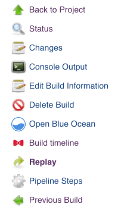

<div align="center">

</div>
<div align="center">
<strong>
Jenkins Timeline (TL) Plugin
</strong>
</div>
<br>
<div align="center">
<a href="https://circleci.com/gh/tophat/jenkins-timeline-plugin">

</a>
<a href="https://jenkins.io">

</a>
<a href="https://www.oracle.com/technetwork/java/javase/downloads/jdk8-downloads-2133151.html">

</a>
<a href="https://www.npmjs.com/package/react">

</a>
<<<<<<< HEAD
<<<<<<< HEAD
<a href="#contributors">
    
</a>
=======
>>>>>>> docs: update slack link
=======
<a href="#contributors">
    
</a>
>>>>>>> feat: add jenkinsfile for publishing (#48)
<a href="https://opensource.tophat.com/slack">

</a>
<a href="https://github.com/tophat/getting-started/blob/master/scorecard.md">

</a>
</div>

# Overview

Jenkins TL is a Jenkins plugin that allows users to gain knowledge about the execution of their pipeline builds.

## Motivation

Using the Jenkins timeline plugin we are able to identify sequential and parallel steps in a pipeline. This plugins gives us awareness and intuition about how long each step takes as well as what steps would have the most impact if optimized.

# Installation

## Manual build

_Make sure that you follow the [development setup and building](#Setting-up-a-development-environment) steps before you attempt building your own plugin package._
- Clone the repository and use `make build_all` to build the plugin `hpi` package.
- _After a successful build, the packaged file is available in `target/jenkins-timeline.hpi`._
- In Jenkins, head to __Manage Jenkins__ > __Manage Plugins__ and use the __Upload Plugin__ functionality available under the __Advanced__ tab.
- You might be prompted to restart Jenkins after installing the plugin.

### Using the JenkinsCI repository

_Available soon!_

# Usage

The plugin adds a __Build Timeline__ link in every Pipeline build page menu. Clicking it will open up the build timeline in a new tab.

<div align="center">

</div>

The timeline can be opened during a build for an incremental breakdown of the job or after a build is completed for an overview of old jobs.

<div align="center">

</div>

# Contributing

## Helpful resources

If you want to know more about the structure of Jenkins plugins and the Java-side of their development, you can peruse the [Jenkins Wiki](https://wiki.jenkins.io/display/JENKINS/Plugin+tutorial) and the [Jenkins Core API reference](https://javadoc.jenkins.io/). You might find the API reference especially useful if you want to tinker with the Java portion of the plugin.

The web application is a standard React app. The [Getting started guide for React](https://reactjs.org/docs/getting-started.html) is a great way to get up to speed with the framework.

## Setting up a development environment

To work on the project, you will need ...

- [Maven 3.1.0+](https://maven.apache.org/download.cgi);
- [A Java development environment (JDK 8)](https://www.oracle.com/technetwork/java/javase/downloads/jdk8-downloads-2133151.html);
- [A local instance of Jenkins](https://jenkins.io/doc/book/installing/);
- [npm](https://www.npmjs.com/get-npm);

### Compatibility note
The linked version of Java (JDK 8) is the preferred version for this project, as Maven seems to have trouble building with other versions.

### Jenkins setup
When installing Jenkins, make sure to allow the installer to add the recommended plugins to Jenkins. This project depends on the [`pipeline`](https://wiki.jenkins-ci.org/display/JENKINS/Pipeline+Plugin) plugin, installed by default as part of the recommended package.

## Building

The makefile is set up with a few useful commands to abstract away `mvn` calls. Call `make build_all` to build the `hpi` file that you can import in your Jenkins instance to install the plugin.

You can find a sample [Jenkinsfile](../devResources/SampleJenkinsfile) under `/devResources` if you need a sample pipeline to visualize or start from.

### Working on the web app

The Node application that is run by the plugin can be worked on without having to rebuild and reinstall the plugin in Jenkins.

To run the web app independently of the rest of the plugin, deactivate your Jenkins instance's security (__Manage Jenkins__ > __Configure Global Security__, untick the __Enable security__ checkbox and apply/save the changes) and alter the web app code as follows:

```
//In webapp_src/src/index.js
const buildUrl = [hardcoded build URL taken from Jenkins]

//In webapp_src/src/components/Dashboard.js
...
getStageInfo = stageEndpoint => {
        stageEndpoint = [Jenkins base URL] + stageEndpoint
        return axios.get(stageEndpoint)
        ...
...
```

These two changes will ensure that the API requests to Jenkins' Workflow API will reach the endpoints properly. Disabling the security will avoid the web app hitting Jenkins' CORS protection.

__Make sure to revert those two changes before opening up a PR or building the plugin.__

From within the `webapp_src` directory, you can use the scripts defined in `packages.json`: `npm run start` and `npm run test` to start the application and run the test suites, respectively.

## Common errors

### `java.nio.file.NoSuchFileException` during builds

If a `java.nio.file.NoSuchFileException` about `hudson.Extension` prevents building using `make build`, make sure that you have set up your `JAVA_HOME` properly.

In `~/.bash_profile`, make sure to export it as:

```
export JAVA_HOME=`/usr/libexec/java_home -v 1.8`
```

# Contributors
Thanks goes to these wonderful people [emoji key](https://github.com/kentcdodds/all-contributors#emoji-key):

<!-- ALL-CONTRIBUTORS-LIST:START - Do not remove or modify this section -->
<!-- prettier-ignore -->
| [<br /><sub><b>Marc Cataford</b></sub>](https://marccataford.com)<br />[💻](https://github.com/tophat/jenkins-timeline-plugin/commits?author=mcataford "Code") [📖](https://github.com/tophat/jenkins-timeline-plugin/commits?author=mcataford "Documentation") [🚇](#infra-mcataford "Infrastructure (Hosting, Build-Tools, etc)") [📦](#platform-mcataford "Packaging/porting to new platform") | [<br /><sub><b>Brandon Baksh</b></sub>](https://www.linkedin.com/in/brandonbaksh/)<br />[📖](https://github.com/tophat/jenkins-timeline-plugin/commits?author=brandonbaksh "Documentation") | [<br /><sub><b>Jake Bolam</b></sub>](https://jakebolam.com)<br />[📖](https://github.com/tophat/jenkins-timeline-plugin/commits?author=jakebolam "Documentation") [🚇](#infra-jakebolam "Infrastructure (Hosting, Build-Tools, etc)") | [<br /><sub><b>Siavash Mahmoudian</b></sub>](https://breezio.com)<br />[🚇](#infra-syavash "Infrastructure (Hosting, Build-Tools, etc)") | [<br /><sub><b>Shouvik DCosta</b></sub>](https://opensource.tophat.com)<br />[📖](https://github.com/tophat/jenkins-timeline-plugin/commits?author=sdcosta "Documentation") |
| :---: | :---: | :---: | :---: | :---: |
<!-- ALL-CONTRIBUTORS-LIST:END -->

We welcome contributions from the community, Top Hatters and non-Top Hatters alike. Check out our [contributing guidelines](CONTRIBUTING.md) for more details.

# Credits
Thanks to [Carol Skelly](https://github.com/iatek) for donating the github organization!
