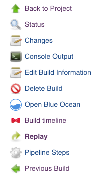

## About

Jenkins TL is a Jenkins plugin that allows users to gain knowledge about the execution of their pipeline builds.

## Motivation

Using the Jenkins timeline plugin we are able to identify sequential and parallel steps in a pipeline. This plugins gives us awareness and intuition about how long each step takes as well as what steps would have the most impact if optimized.

## Installation

### Manual build

_Make sure that you follow the [development setup and building](https://github.com/tophat/jenkins-timeline-plugin#setting-up-a-development-environment) steps before you attempt building your own plugin package._
- Clone the repository and use `make build_and_export` to build the plugin `hpi` package.
- _After a successful build, the packaged file is available in `target/jenkins-timeline.hpi`._
- In Jenkins, head to __Manage Jenkins__ > __Manage Plugins__ and use the __Upload Plugin__ functionality available under the __Advanced__ tab.
- You might be prompted to restart Jenkins after installing the plugin.

### Using the JenkinsCI repository

_Available soon!_

## Usage

The plugin adds a __Build Timeline__ link in every Pipeline build page menu. Clicking it will open up the build timeline in a new tab.

The timeline can be opened during a build for an incremental breakdown of the job or after a build is completed for an overview of old jobs.

## Helpful Resources
If you want to know more about the structure of Jenkins plugins and the Java-side of their development, you can peruse the [Jenkins Wiki](https://wiki.jenkins.io/display/JENKINS/Plugin+tutorial) and the [Jenkins Core API reference](https://javadoc.jenkins.io/). You might find the API reference especially useful if you want to tinker with the Java portion of the plugin.

The web application is a standard React app. The [Getting started guide for React](https://reactjs.org/docs/getting-started.html) is a great way to get up to speed with the framework.
