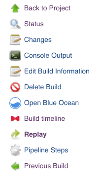
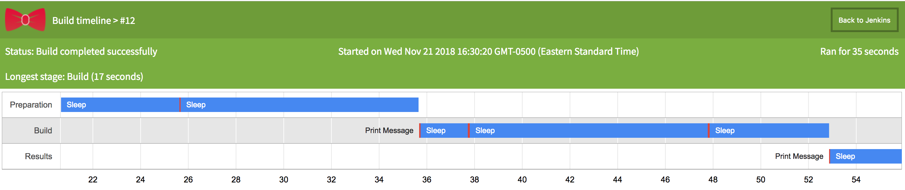

The plugin adds a __Build Timeline__ link in every Pipeline build page menu. Clicking it will open up the build timeline in a new tab.

<div align="center">

</div>

The timeline can be opened during a build for an incremental breakdown of the job or after a build is completed for an overview of old jobs.

<div align="center">

</div>

## Common errors

### `java.nio.file.NoSuchFileException` during builds

If a `java.nio.file.NoSuchFileException` about `hudson.Extension` prevents building using `make build`, make sure that you have set up your `JAVA_HOME` properly.

In `~/.bash_profile`, make sure to export it as:

```
export JAVA_HOME=`/usr/libexec/java_home -v 1.8`
```
